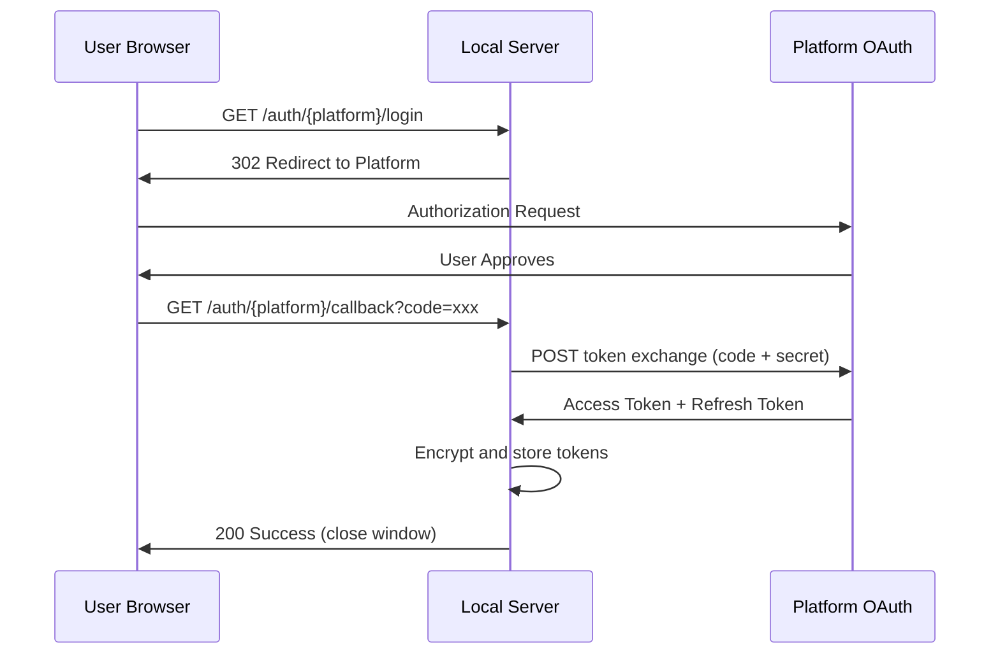
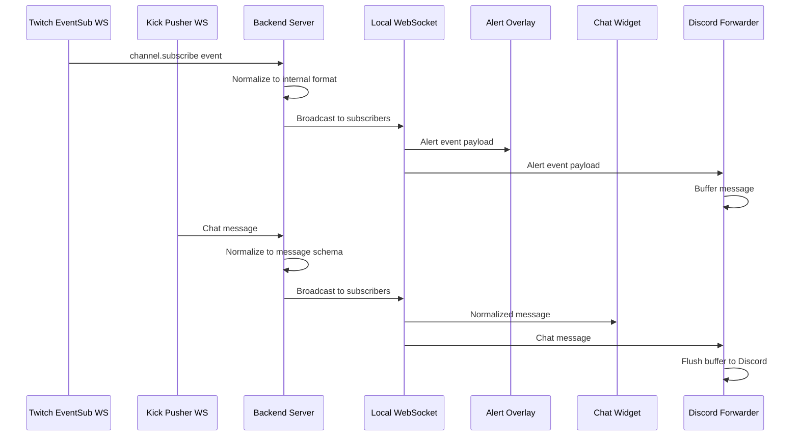
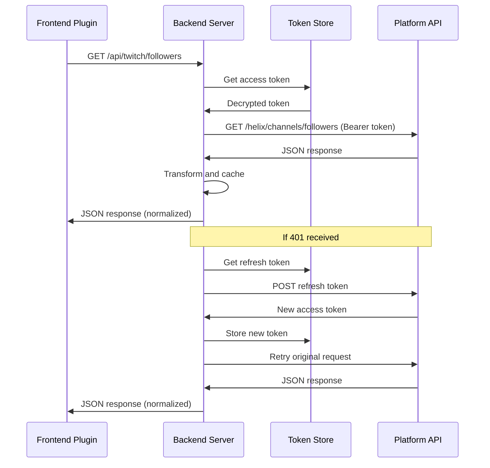
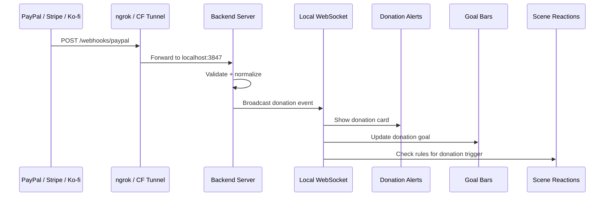

# StreamPlugins Architecture

> A suite of 9 OBS Studio plugins for multi-platform streaming (Twitch, YouTube, Kick).

---

## 1. System Overview

StreamPlugins uses a two-layer architecture designed around OBS Studio's native web
rendering capabilities:

- **Frontend Layer** -- Static HTML/CSS/JS files served locally and loaded into OBS as
  Browser Sources (overlays rendered on stream) or Browser Docks (control panels in the
  OBS UI). Each plugin ships one or more HTML entry points sized for its use case.

- **Backend Layer** -- A single Node.js server running on `localhost:3847` that acts as the
  secure intermediary between OBS frontends and external platform APIs. It handles OAuth
  token exchange, API proxying with rate-limit management, persistent WebSocket connections,
  Discord webhook forwarding, and static file serving for the frontends.

### High-Level Diagram

```mermaid
graph TD
    subgraph obsStudio["OBS Studio"]
        subgraph browserSources["Browser Sources (Overlays)"]
            metricsWidget["Metrics Widget"]
            alertOverlay["Alert Overlay"]
            chatWidget["Chat Widget"]
            viewerCountWidget["Viewer Count"]
            goalBarsOverlay["Goal Bars"]
            donationOverlay["Donation Alerts"]
        end
        subgraph browserDocks["Browser Docks (Control Panels)"]
            titleUpdater["Title Updater"]
            settingsPanel["Settings Panel"]
            sceneReactionsDock["Scene Reactions"]
            goalBarSettings["Goal Bars Settings"]
            donationSettings["Donation Alerts Settings"]
        end
    end

    subgraph localServer["Local Node.js Server (localhost:3847)"]
        authService["Auth Service"]
        apiProxy["API Proxy"]
        wsManager["WebSocket Manager"]
        discordForwarder["Discord Forwarder"]
        staticFileServer["Static File Server"]
        webhookHandler["Webhook Handler"]
        obsWsClient["OBS WebSocket Client"]
    end

    subgraph externalApis["External APIs"]
        twitchHelix["Twitch Helix API"]
        youtubeData["YouTube Data API v3"]
        kickApi["Kick Public API v1"]
        twitchEventSub["Twitch EventSub WS"]
        kickPusher["Kick Pusher WS"]
        discordWebhooks["Discord Webhooks"]
        paypalWebhook["PayPal / Stripe / Ko-fi Webhooks"]
        obsWebsocket["OBS WebSocket (localhost:4455)"]
    end

    metricsWidget -->|"HTTP/WS"| localServer
    alertOverlay -->|"HTTP/WS"| localServer
    chatWidget -->|"HTTP/WS"| localServer
    viewerCountWidget -->|"HTTP/WS"| localServer
    goalBarsOverlay -->|"HTTP/WS"| localServer
    donationOverlay -->|"HTTP/WS"| localServer
    titleUpdater -->|"HTTP"| localServer
    settingsPanel -->|"HTTP"| localServer
    sceneReactionsDock -->|"HTTP/WS"| localServer
    goalBarSettings -->|"HTTP"| localServer
    donationSettings -->|"HTTP"| localServer

    staticFileServer -->|"serves HTML/JS/CSS"| obsStudio

    apiProxy -->|"HTTPS"| twitchHelix
    apiProxy -->|"HTTPS"| youtubeData
    apiProxy -->|"HTTPS"| kickApi
    wsManager -->|"WSS"| twitchEventSub
    wsManager -->|"WSS"| kickPusher
    discordForwarder -->|"HTTPS POST"| discordWebhooks
    authService -->|"OAuth HTTPS"| twitchHelix
    authService -->|"OAuth HTTPS"| youtubeData
    authService -->|"OAuth HTTPS"| kickApi
    webhookHandler -->|"HTTPS POST"| paypalWebhook
    obsWsClient -->|"WS"| obsWebsocket
```



All communication between OBS and the local server occurs over `localhost`. No traffic
leaves the machine except authenticated requests to platform APIs and Discord webhooks.

---

## 2. Why This Architecture

### Web-Based UI

OBS Studio ships with Chromium Embedded Framework (CEF) and natively supports loading
local or remote URLs as Browser Sources (rendered on the video canvas) and Browser Docks
(panels in the OBS workspace). This means any UI built with HTML/CSS/JS can be displayed
inside OBS without writing platform-specific C++ rendering code. The web stack also enables
rapid iteration, easy theming, and a familiar developer experience.

### Local Server Requirement

A local backend is necessary for several reasons that cannot be solved in browser-only code:

1. **OAuth Token Exchange** -- Platform OAuth flows require a server-side callback endpoint
   to exchange authorization codes for tokens. Client credentials and secrets must never be
   exposed in frontend code.

2. **CORS Avoidance** -- Browser Sources operate under standard web security policies.
   Many platform APIs do not set permissive CORS headers. The local server acts as a
   same-origin proxy, eliminating cross-origin restrictions entirely.

3. **Persistent WebSocket Management** -- Twitch EventSub and Kick Pusher connections must
   remain open continuously, surviving overlay refreshes and dock reloads. The server holds
   these connections and fans out events to connected frontends.

4. **Discord Webhook URL Protection** -- Discord webhook URLs are effectively bearer tokens.
   Storing them server-side prevents exposure in frontend source and browser dev tools.

### Monorepo Structure

All nine plugins share a single authentication flow, configuration store, and set of
platform connections. A monorepo allows:

- Single OAuth login per platform shared across all plugins
- Shared WebSocket connections (one Twitch EventSub connection serves both Alerts and Chat)
- Unified configuration file and credential storage
- Consistent build tooling and dependency management

### Dual Distribution Model

StreamPlugins supports two installation methods to accommodate different user preferences:

1. **Native OBS Plugin (C++ wrapper)** -- A minimal C++ shared library that OBS loads at
   startup. It auto-starts the Node.js server as a child process and registers Browser Docks
   via the OBS plugin API. Users get a seamless experience with no manual URL entry.

2. **Standalone Tray App** -- A system tray application that runs the Node.js server
   independently. Users manually add Browser Sources/Docks by entering
   `http://localhost:3847/plugins/...` URLs. This mode works without modifying OBS
   installation directories and supports portable/flatpak OBS installations.

---

## 3. Plugin Architecture

### Plugin 1: Stream Metrics Widget

**Type:** Browser Source (overlay) + Browser Dock (settings)

Displays real-time follower counts, subscriber counts, and viewer numbers as an on-stream
overlay. The settings dock allows configuring which metrics are visible, layout, and theme.

#### APIs Used

| Platform | Endpoint | Purpose |
|----------|----------|---------|
| Twitch | `GET /helix/channels/followers` | Follower count |
| Twitch | `GET /helix/subscriptions` | Subscriber count |
| Twitch | `GET /helix/streams` | Live viewer count |
| YouTube | `channels.list (part=statistics)` | Subscriber count, view count |
| YouTube | `members.list` | Channel member count |
| YouTube | `videos.list (part=liveStreamingDetails)` | Concurrent viewers |
| Kick | `GET /public/v1/channels/{slug}` | Follower count, subscriber count |
| Kick | `GET /public/v1/livestreams/{slug}` | Live viewer count |

#### Auth Scopes

- **Twitch:** `moderator:read:followers`, `channel:read:subscriptions`
- **YouTube:** `youtube.readonly`, `youtube.channel-memberships.creator`
- **Kick:** `channel:read`

#### Polling Strategy

- Follower/subscriber counts: every 30 seconds (data changes infrequently)
- Live viewer counts: every 10 seconds (near-real-time display)
- Polling intervals are configurable per-metric in the settings dock

---

### Plugin 2: Stream Title Updater

**Type:** Browser Dock (control panel)

A unified form for updating stream title, category, tags, and metadata across all connected
platforms simultaneously from a single interface within OBS.

#### APIs Used

| Platform | Endpoint | Purpose |
|----------|----------|---------|
| Twitch | `PATCH /helix/channels` | Update title, game, tags |
| YouTube | `liveBroadcasts.update` | Update broadcast title, description |
| YouTube | `videos.update (part=snippet)` | Update video metadata |
| Kick | `PATCH /public/v1/channels/{slug}` | Update title, category, tags |

#### Fields Per Platform

**Twitch:**
- Title: max 140 characters
- Category (Game/IRL): selected from Twitch category search
- Tags: max 10, free-text

**YouTube:**
- Title: max 100 characters
- Description: max 5,000 characters
- Category: selected from fixed YouTube category list
- Tags: comma-separated, max 500 characters total
- Privacy: public, unlisted, or private

**Kick:**
- Title: free-text
- Category: selected from Kick category list
- Tags: max 10

The UI shows platform-specific field limits and validates before submission. Updates are
sent in parallel to all enabled platforms.

---

### Plugin 3: Multistream Alerts

**Type:** Browser Source (overlay)

Renders animated alert popups for follows, subscriptions, raids, cheers, and gifted subs
from all platforms with configurable animations, sounds, and display durations.

#### Event Sources

**Twitch EventSub WebSocket:**
- `channel.subscribe` -- new subscription
- `channel.subscription.gift` -- gifted subscriptions
- `channel.subscription.message` -- resub with message
- `channel.follow` -- new follower
- `channel.raid` -- incoming raid
- `channel.cheer` -- bits cheered

**YouTube Live Chat Polling:**
- `newSponsorEvent` -- new channel member
- `superChatEvent` -- Super Chat received
- `membershipGiftingEvent` -- gifted memberships

YouTube does not provide a WebSocket interface; the server polls `liveChatMessages.list`
at a 5-second interval and filters for monetization/membership events.

**Kick Pusher WebSocket:**
- `FollowEvent` -- new follower
- `SubscriptionEvent` -- new subscription
- `GiftedSubscriptionsEvent` -- gifted subscriptions

#### Alert Queue

Events are queued and displayed sequentially with configurable minimum display time
(default 5 seconds). High-priority events (raids, large gift bombs) can interrupt the queue.

---

### Plugin 4: Unified Chat Widget

**Type:** Browser Source (overlay) + Browser Dock (moderation panel)

Merges chat messages from all platforms into a single timeline, rendered as an overlay
and optionally in a dock for moderation/reading.

#### Connection Methods

**Twitch IRC WebSocket:**
- Endpoint: `wss://irc-ws.chat.twitch.tv:443`
- Mode: anonymous read-only (no auth required for reading)
- Joins channel via `JOIN #channelname` after `CAP REQ :twitch.tv/tags twitch.tv/commands`

**YouTube Live Chat:**
- Endpoint: `liveChatMessages.list` (REST polling)
- Uses `pageToken` for pagination
- Poll interval: 5-10 seconds (adaptive based on `pollingIntervalMillis` in response)
- Requires active `liveBroadcast` ID

**Kick Pusher WebSocket:**
- Subscribe to channel: `chatrooms.{channelId}.v2`
- No authentication required for reading public chat
- Receives structured JSON messages with user metadata

#### Normalized Message Schema

All incoming messages are normalized to a common format before being sent to frontends:

```json
{
  "id": "unique-message-id",
  "platform": "twitch|youtube|kick",
  "timestamp": "2026-01-15T12:34:56.789Z",
  "user": {
    "name": "username",
    "displayName": "DisplayName",
    "avatar": "https://...",
    "badges": ["subscriber", "moderator"],
    "color": "#FF5500"
  },
  "content": "Message text with emotes replaced",
  "emotes": [
    {
      "id": "emote-id",
      "name": "Kappa",
      "url": "https://...",
      "positions": [[0, 4]]
    }
  ]
}
```

This schema enables the frontend to render messages uniformly regardless of source platform,
with platform-specific badge icons and emote rendering.

---

### Plugin 5: Discord Logger

**Type:** Background service + Browser Dock (settings)

Forwards stream events and chat messages to Discord channels via webhooks. Operates as a
consumer of the normalized data produced by Plugins 3 and 4.

#### Data Sources

- Subscribes to the alert event stream from Plugin 3 (follows, subs, raids, cheers)
- Subscribes to the normalized chat stream from Plugin 4
- Optionally logs stream start/stop events

#### Discord Integration

- Sends messages via `POST https://discord.com/api/webhooks/{id}/{token}`
- Uses Discord embed format for rich event cards
- Messages are batched at 2-5 second intervals to stay within rate limits
- Rate limit: 30 requests per 60 seconds per webhook URL
- Separate webhook URLs configurable for: alerts, chat logs, stream status

#### Batching Strategy

The forwarder accumulates messages in a buffer and flushes either when the buffer reaches
10 messages or when the batch interval (default 3 seconds) elapses, whichever comes first.
If a 429 response is received, the forwarder backs off using the `Retry-After` header.

---

### Plugin 6: Combined Viewer Count

**Type:** Browser Source (overlay)

Simple widget showing total combined viewer count across all platforms with per-platform
breakdown. Displays a single headline number (sum of all live viewers) alongside smaller
per-platform counts with platform icons.

#### APIs Used

Uses the same unified metrics endpoint as Plugin 1: `GET /api/metrics`. The server
aggregates viewer counts from Twitch, YouTube, and Kick into a single response.

#### Polling Strategy

- Polls every 10 seconds for near-real-time viewer numbers
- Uses a count-up animation when numbers change to smooth visual transitions
- Transparent background for clean overlay compositing

---

### Plugin 7: Goal Bars

**Type:** Browser Source (overlay) + Browser Dock (settings)

Animated progress bars for subscriber, follower, and donation goals. Supports multiple
simultaneous goals displayed as stacked horizontal bars with configurable labels, colors,
and targets.

#### APIs Used

| Source | Endpoint | Purpose |
|--------|----------|---------|
| Metrics | `GET /api/metrics` | Current subscriber/follower counts |
| WebSocket | `donation` event | Real-time donation amount updates |

#### Settings Dock

The Goal Bars Settings dock allows configuring:
- Goal type (subscribers, followers, or donations)
- Label text displayed on the bar
- Target value and starting value
- Current progress (auto-updated for subs/followers, accumulated for donations)

#### Configuration

Goals are stored in `config.json` under the `goals` array. Each goal entry defines its
type, label, target, current value, and start value. The overlay reads this array on load
and subscribes to relevant events for real-time updates.

---

### Plugin 8: Donation Alerts

**Type:** Browser Source (overlay) + Browser Dock (settings)

Alert overlay for donations received via PayPal, Stripe, Ko-fi, Buy Me a Coffee, and
Streamlabs. Displays animated donation cards with donor name, amount, and optional message.

#### Architecture

External payment services send webhook POST requests to the local server. Since the server
runs on localhost, a public tunnel (ngrok or Cloudflare Tunnel) is required to receive
incoming webhooks from the internet.

```
External Service --> Public Tunnel --> localhost:3847/webhooks/{platform}
```

#### Server-Side Handlers

| File | Platform |
|------|----------|
| `server/src/webhooks/paypal.ts` | PayPal IPN/Webhooks |
| `server/src/webhooks/stripe.ts` | Stripe Webhooks |
| `server/src/webhooks/kofi.ts` | Ko-fi Webhooks |
| `server/src/webhooks/buymeacoffee.ts` | Buy Me a Coffee Webhooks |
| `server/src/webhooks/streamlabs.ts` | Streamlabs API |

Route registration is centralized in `server/src/routes/webhooks.ts`.

#### Event Normalization

All incoming webhook payloads are validated against platform-specific signatures, then
normalized to a unified `donation` event schema and broadcast via WebSocket to all
connected frontends:

```json
{
  "type": "donation",
  "platform": "paypal|stripe|kofi|buymeacoffee|streamlabs",
  "donor": "DisplayName",
  "amount": 5.00,
  "currency": "USD",
  "message": "Optional donor message",
  "timestamp": "2026-01-15T12:34:56.789Z"
}
```

#### Settings Dock

The Donation Alerts Settings dock configures:
- Tunnel URL (ngrok/Cloudflare Tunnel public URL)
- API keys and webhook secrets per platform
- Which donation sources are enabled

---

### Plugin 9: OBS Scene Reactions

**Type:** Browser Dock (control panel)

Automates OBS scene and source changes via obs-websocket v5 in response to stream events.
Enables reactive scene switching, source visibility toggling, and media playback triggered
by alerts, donations, raids, and other events.

#### Server-Side Connection

The OBS WebSocket client lives at `server/src/obswebsocket/client.ts` and maintains a
persistent connection to `ws://localhost:4455` (the default obs-websocket port).

#### Supported Actions

| Action | Description |
|--------|-------------|
| `switch_scene` | Switch to a target scene, optionally reverting after a duration |
| `show_source` | Make a source visible in the current scene |
| `hide_source` | Hide a source in the current scene |
| `play_media` | Trigger playback on a media source |

#### Rule Builder

The dock provides a rule builder UI where users define automation rules:

- **Trigger:** Event type (raid, donation, follow, subscribe, cheer, gift)
- **Action:** One of the supported actions above
- **Target:** Scene or source name (auto-discovered from OBS)
- **Duration:** How long to hold the action (seconds) before reverting
- **Revert Scene:** Scene to return to after duration expires
- **Min Amount:** Minimum trigger threshold (e.g., minimum donation amount)
- **Enabled:** Toggle individual rules on/off

#### Scene/Source Discovery

The plugin queries OBS via obs-websocket to enumerate available scenes and sources,
presenting them as selectable dropdowns in the rule builder.

#### Event Matching

The Scene Reactions engine listens to all normalized stream events flowing through the
WebSocket Manager (alerts, donations, chat events). When an event matches an enabled rule's
trigger type and meets any configured thresholds, the corresponding action fires.

---

## 4. Shared Infrastructure

### Auth Service

The Auth Service manages OAuth flows for all three platforms, storing and refreshing tokens
transparently for all plugins.

#### OAuth Sequence



#### Platform OAuth Details

**Twitch OAuth 2.0 (Authorization Code Flow):**
- Authorization URL: `https://id.twitch.tv/oauth2/authorize`
- Token URL: `https://id.twitch.tv/oauth2/token`
- Scopes: `moderator:read:followers channel:read:subscriptions channel:manage:broadcast bits:read user:read:chat`
- Refresh: tokens refreshed automatically when 401 received

**YouTube Google OAuth 2.0 (Authorization Code Flow):**
- Authorization URL: `https://accounts.google.com/o/oauth2/v2/auth`
- Token URL: `https://oauth2.googleapis.com/token`
- Scopes: `https://www.googleapis.com/auth/youtube.readonly https://www.googleapis.com/auth/youtube.force-ssl https://www.googleapis.com/auth/youtube.channel-memberships.creator`
- Refresh: uses refresh token; access tokens expire after 1 hour

**Kick OAuth 2.1 (Authorization Code Flow with PKCE):**
- Authorization URL: `https://id.kick.com/oauth/authorize`
- Token URL: `https://id.kick.com/oauth/token`
- Scopes: `channel:read channel:write chat:write events:subscribe user:read`
- PKCE: S256 code challenge required; no client secret transmitted to authorization endpoint
- Refresh: refresh tokens rotated on each use

#### Token Storage

Tokens are persisted to `~/.streamplugins/tokens.json` encrypted with AES-256-GCM.
The encryption key is derived from the machine's unique hardware ID (motherboard serial,
disk serial, or OS installation ID) via PBKDF2 with 100,000 iterations. This ensures
tokens are not portable between machines and are unreadable if the file is copied.

Structure of the encrypted file:

```json
{
  "version": 1,
  "twitch": {
    "iv": "base64...",
    "tag": "base64...",
    "data": "base64..."
  },
  "youtube": {
    "iv": "base64...",
    "tag": "base64...",
    "data": "base64..."
  },
  "kick": {
    "iv": "base64...",
    "tag": "base64...",
    "data": "base64..."
  }
}
```

---

### WebSocket Manager

The WebSocket Manager maintains long-lived connections to platform real-time services and
multiplexes events to internal subscribers.

#### Managed Connections

| Connection | Protocol | Purpose |
|-----------|----------|---------|
| Twitch EventSub | WSS to `wss://eventsub.wss.twitch.tv/ws` | Subscription, follow, raid, cheer events |
| Twitch IRC | WSS to `wss://irc-ws.chat.twitch.tv:443` | Chat message stream |
| Kick Pusher | WSS to Pusher endpoint per channel | Chat and channel events |

#### Reconnection Strategy

All WebSocket connections use exponential backoff with jitter on disconnection:

1. Initial retry delay: 1 second
2. Multiplier: 2x per attempt
3. Maximum delay: 60 seconds
4. Jitter: +/- 25% randomization to prevent thundering herd
5. Reset delay to initial after 5 minutes of stable connection

#### Connection Sharing

A single WebSocket connection is shared across multiple plugin consumers. For example,
the Twitch EventSub connection delivers events to both Plugin 3 (Alerts) and Plugin 5
(Discord Logger). Internally, the manager uses a pub/sub pattern where plugins register
interest in specific event types.

#### Frontend WebSocket

The server exposes a local WebSocket at `ws://localhost:3847/ws` for frontend connections.
Frontends subscribe to event channels:

```
{ "action": "subscribe", "channels": ["twitch.events", "kick.chat", "alerts"] }
```

Events are broadcast to all subscribed frontends with minimal latency.

---

### Theme System

All plugins share a user-selectable theme system. Seven built-in themes are available:
Dark (default), Light, Transparent, AMOLED, Midnight Blue, Cyberpunk, and Forest. The
theme is stored in `config.json` and applied via `data-theme` attribute on `<html>`.
`theme-loader.js` reads the theme from localStorage (instant, no flicker) and confirms
from the server config. A `theme-changed` WebSocket event keeps all open docks/overlays
in sync.

---

### Config System

All configuration is stored in `~/.streamplugins/config.json` with the following structure:

```json
{
  "version": 1,
  "server": {
    "port": 3847,
    "host": "127.0.0.1"
  },
  "theme": "dark",
  "platforms": {
    "twitch": {
      "clientId": "your-app-client-id",
      "channelName": "yourchannel",
      "channelId": "123456789"
    },
    "youtube": {
      "clientId": "your-google-client-id",
      "channelId": "UCxxxxxxxxxxxxxxxx"
    },
    "kick": {
      "clientId": "your-kick-client-id",
      "channelSlug": "yourchannel",
      "channelId": 12345
    }
  },
  "plugins": {
    "metrics": {
      "enabled": true,
      "pollIntervalCounts": 30000,
      "pollIntervalViewers": 10000,
      "visibleMetrics": ["followers", "subscribers", "viewers"],
      "theme": "dark"
    },
    "titleUpdater": {
      "enabled": true,
      "syncPlatforms": ["twitch", "youtube", "kick"]
    },
    "alerts": {
      "enabled": true,
      "displayDuration": 5000,
      "enabledEvents": ["follow", "subscribe", "raid", "cheer", "gift"],
      "theme": "default"
    },
    "chat": {
      "enabled": true,
      "maxMessages": 200,
      "showBadges": true,
      "showAvatars": false,
      "theme": "dark"
    },
    "discordLogger": {
      "enabled": true,
      "webhooks": {
        "alerts": "stored-server-side",
        "chat": "stored-server-side",
        "status": "stored-server-side"
      },
      "batchInterval": 3000,
      "logChat": true,
      "logAlerts": true,
      "logStreamStatus": true
    }
  },
  "goals": [
    { "type": "subscribers", "label": "Sub Goal", "target": 500, "current": 342, "startValue": 0 }
  ],
  "donations": {
    "tunnelUrl": "https://abc.ngrok.io",
    "paypalWebhookId": "...",
    "stripeSecret": "whsec_...",
    "kofiToken": "...",
    "bmcSecret": "...",
    "streamlabsToken": "...",
    "enabled": { "paypal": true, "stripe": true, "kofi": true, "buymeacoffee": true, "streamlabs": true }
  },
  "sceneReactions": {
    "rules": [
      { "trigger": "raid", "action": "switch_scene", "target": "BRB", "duration": 30, "revertScene": "Main", "minAmount": 0, "enabled": true }
    ]
  },
  "discord": {
    "webhookUrls": {
      "alerts": "https://discord.com/api/webhooks/...",
      "chat": "https://discord.com/api/webhooks/...",
      "status": "https://discord.com/api/webhooks/..."
    }
  }
}
```

Configuration changes are watched via `fs.watch` and hot-reloaded without server restart.
The settings dock provides a UI for editing all values with validation.

---

## 5. Data Flow Diagrams

### Real-Time Events Flow



### API Polling Flow



### Donation Webhook Flow



---

## 6. API Rate Limits

| Platform | Limit | Scope | Mitigation Strategy |
|----------|-------|-------|-------------------|
| Twitch Helix | 800 requests/minute | Per Client ID | Request coalescing: multiple plugins share cached responses. Cache TTL matches poll interval. |
| YouTube Data API | 10,000 units/day | Per Project | Aggressive caching. `channels.list` costs 1 unit, `liveChatMessages.list` costs 5 units. Adaptive polling: increase interval when chat is slow. Budget monitoring with warnings at 70% usage. |
| Kick Public API | 10 requests/second | Per IP | Simple rate limiter with token bucket. Requests are queued if bucket is empty. |
| Discord Webhooks | 30 requests/60 seconds | Per Webhook URL | Message batching (2-5s intervals). Multiple embeds per request (up to 10). Retry-After header respected with automatic backoff. |

### Rate Limit Implementation

The API proxy maintains per-platform rate limit state using a sliding window counter.
When a platform returns rate limit headers (`Ratelimit-Remaining`, `Ratelimit-Reset`),
the proxy updates its internal state to preemptively delay requests before hitting limits.

For YouTube specifically, the server tracks daily quota consumption and exposes it via
`GET /api/youtube/quota` so the settings panel can display remaining budget.

---

## 7. Technology Stack

| Layer | Technology | Version | Purpose |
|-------|-----------|---------|---------|
| Runtime | Node.js | 22 LTS | Server runtime, long-term support for stability |
| Backend Framework | Express.js | 5.x | HTTP routing, middleware, static serving |
| Language | TypeScript | 5.x | Type safety across server codebase |
| Frontend | Vanilla HTML/CSS/JS | -- | No framework overhead, fast load in CEF |
| Bundler | esbuild | latest | Fast TypeScript compilation and bundling |
| Binary Packaging | pkg | latest | Single-binary distribution for standalone mode |
| Native Plugin | C++ with CMake | C++17 | OBS plugin API integration, process management |
| Testing | Vitest | latest | Unit and integration testing |
| OBS Automation | obs-websocket-js | 5.x | OBS Studio automation via obs-websocket v5 |
| CI/CD | GitHub Actions | -- | Automated testing, building, and releases |

### Build Outputs

- `dist/server/` -- Bundled Node.js server (single JS file via esbuild)
- `dist/frontend/` -- Static HTML/CSS/JS files for all plugins
- `dist/standalone/` -- Packaged binary (Windows .exe, macOS, Linux) via pkg
- `dist/obs-plugin/` -- Compiled .dll/.so/.dylib for OBS native plugin

### Development Workflow

```
npm install          # Install dependencies
npm run dev          # Start server with hot-reload (nodemon + esbuild watch)
npm run build        # Production build (server + frontend)
npm run test         # Run Vitest suite
npm run package      # Create standalone binary
npm run plugin       # Build native OBS plugin (requires CMake + OBS SDK)
```

---

## 8. Security Considerations

- The server binds exclusively to `127.0.0.1` and refuses connections from non-loopback
  addresses. No network exposure.
- OAuth client secrets are stored in environment variables or the encrypted token file,
  never in frontend code or version control.
- Discord webhook URLs are never sent to frontends; the Discord Logger operates entirely
  server-side.
- Token encryption uses AES-256-GCM with a machine-derived key, preventing token theft
  via file copy.
- The server validates all incoming requests from frontends against expected schemas to
  prevent injection via malicious Browser Source URLs.

---

## 9. Deployment Architecture

### Native OBS Plugin Mode

```
OBS Studio starts
  -> Loads streamplugins.dll/.so
    -> Plugin spawns Node.js server as child process
    -> Plugin registers Browser Docks via OBS frontend API
    -> Browser Sources added manually or via scene collection import
  -> On OBS exit: plugin sends SIGTERM to server process
```

### Standalone Tray App Mode

```
User launches StreamPlugins.exe / .app
  -> Tray icon appears in system tray
  -> Node.js server starts on localhost:3847
  -> User opens browser to http://localhost:3847/setup for initial config
  -> User manually adds Browser Source URLs in OBS
  -> Tray app persists across OBS restarts
```

Both modes run the identical Node.js server; the difference is lifecycle management and
how Browser Docks are registered.
